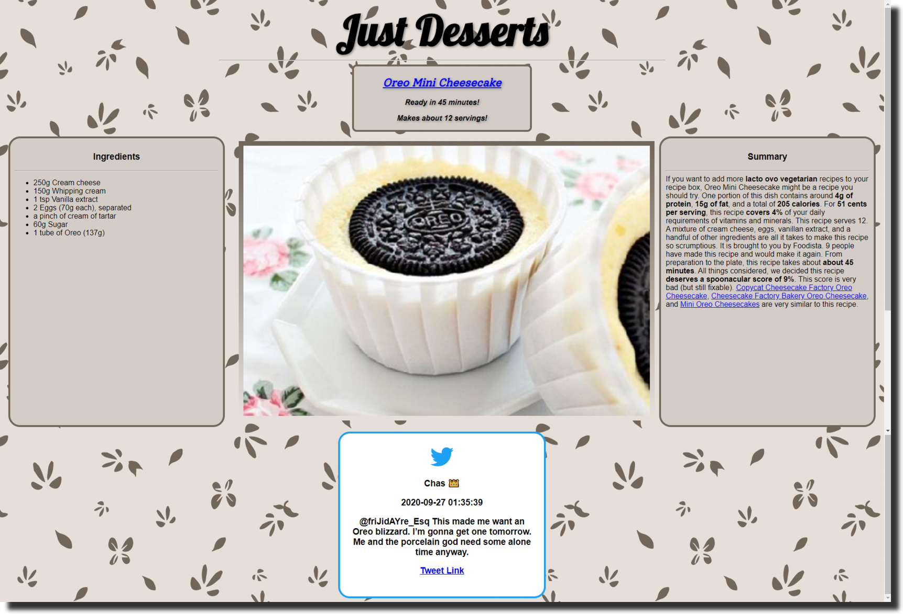

# Recipe Fetcher

[View a live version of this project here!](https://nameless-beach-04617.herokuapp.com/)

---

This web app is a simple app that retrieves a random recipe. It's currently configured to only show various desserts, but it could be easily configured to display a selection of different dishes. Along with retrieving a recipe, it also fetches a random tweet of twitter that includes the dish's name in the tweet. Both of these are displayed on the page.
## Technologies Used
`Tweepy` - A twitter wrapper that works with Python, used to retrieve the random tweet.\
`Spoonacular API` - Used to fetch the random recipe, as long with the ingredients and an image.\
`Flask` - The microframework off which the site is built off of.\
`HTML/CSS` - Used to lay out and beautify the site.\
`Heroku` - Used to deploy the app.\

## How to run your own instance
1. Sign up for a [Twitter Developer account](https://developer.twitter.com/en) and generate your own set of API Keys/Access Tokens.
2. Sign up for [Spoonacular](https://spoonacular.com/food-api), generate an API Key there as well.
3. Clone the repository and create a file named `auth.env`. You can do this by using the following commands
```
git clone https://github.com/NJIT-CS490/project1-ayh7
cd project1-ayh7
touch auth.env
```
4. Copy the following template to the `auth.env` file, fill in the API Keys and Access Tokens that you generated. (Replace the TODO's)
```
export TWITTER_CONSUMER_KEY=TODO
export TWITTER_CONSUMER_SECRET=TODO
export TWITTER_ACCESS_TOKEN=TODO
export TWITTER_ACCESS_TOKEN_SECRET=TODO
export SPOONACULAR_KEY=TODO
```
5. Type in the command `source auth.env` to load in the environment variables that you just created.
6. Install the required python libraries, Flask and Tweepy. This can be done by running `pip install flask && pip install tweepy`
7. Run the app by using the command `python main.py`

## How to run your own instance on Heroku
1. Follow steps one and two in the "How to run your own instance" section of this README.
2. Create an account at [Heroku.com](https://www.heroku.com/).
3. Clone the repository to a local directory by using the command `git clone https://github.com/NJIT-CS490/project1-ayh7`
4. Navigate to the folder you just cloned by using the command `cd project1-ayh7`
5. Install heroku in the directory using the command `npm install -g heroku`
6. Type the command `heroku login -i`, and login using your Heroku.com credentials.
7. Type `heroku create` on the command line, this will create your own heroku instance in your current directory.
8. Type `git push heroku master`, this will push your files to heroku so it can be deployed on their end.
9. Go to the [heroku dashboard](https://dashboard.heroku.com/apps) and select the heroku app that you just created.
10. On the top, click settings.
11. Scroll down to the `Config Vars` section. From step 4 of the "How to run your own instance" section of this README, fill in the five required keys and tokens. Make sure there are no typos in the variables!
12. On the top right, press `Open App`. This should show you the final product!

## Current Issues & Future Features
### Issue: Missing Images
There are some instances where the Spoonacular API will return a recipe, but the recipe will have no image associated with it. Instead, Spoonacular will return a default "no image found" image. This could be resolved by checking each response to make sure there is an image attached. If there is no image attached, then it should query again and choose a recipe that has an image.
### Future Feature: Animation
A feature that I think would be very neat to have is to have all the text in the page, as well as the image, fade in on a refresh. Along with this, it would be beneficial to have an existing refresh button on the page so the user doesn't have to manually refresh the page each time. The fading could be done with some pretty advanced css, but more realistically it could be done with a framework like jquery or react.
### Future Feature: Searching for dishes
Along with having a recipe being dynamically generated, it would be very useful for the user to have the ability to search for a specific dish. This could be used in conjunction with the random recipe generation. A user could be inspired by a random recipe and realize what they may be hungry for, and then could search for the recipe right in the same website instead of having to do their own research. This could also be done using a frontend framework like jquery or react.

## Resolved Issues
### CSS Styling
**Problem:** When attempting to style the CSS, it wouldn't refresh on the actual website. The HTML would stop reflecting the CSS. I tried troubleshooting this by replacing the file and deleting the file entirely, but nothing seemed to work.\
**Solution:** After some more troubleshooting and a consultation with the TA, we found out that it was chrome caching the old version of the CSS. No matter what you do, or if you delete the whole css file, chrome has saved the previous version of the CSS file and keeps it loaded. This can be fixed by hard refreshing (`Shift+Click` the Refresh button) the page.

### Incomplete Tweets
**Problem:** A problem that kept occuring was that tweets would sometimes be cut off at 140 characters. Tweepy would signify this by adding a trailing elipses at the end of the tweet. This was especially problematic when I realized that sometimes the tweets would seem completely irrelevant to the dish because the relevance to the dish was truncated at the end of the tweet.\
**Solution:** After a while of going through stack overflow and reading over the [tweepy API documentation](http://docs.tweepy.org/en/latest/api.html), the cause of the problem became clear. Twitter only used to allow 140 characters in their tweets, which is what tweepy supported. When twitter shifted to double their character count, tweepy instead classified tweets as regular tweets 140 characters or below, or extended tweets. The old implementation only supported shorter tweets, and not the extended variety. This was resolved by querying the search to support extended tweets, and to use the `full_text` attribute to get all of the text of the tweet.

### Trouble with Intermediate CSS Styling
**Problem:** The basic framework of the website was down, and the relevant information was sent to the HTML to be rendered, but the use of CSS was something that was extremely difficult for me to wrap my head around. The main problem I encountered was trying to get things spaced out properly. This required a lot of research about things I haven't heard of before such as padding and margin.\
**Solution:** A lot of research was done in order to gain a rudimentary understanding of CSS, but [this video](https://www.youtube.com/watch?v=yfoY53QXEnI) by Traversy Media proved to be invaluable. It went over a lot of the basics of CSS that I could not wrap my head around. One thing that stood out to me was that I was trying to use the grid system to layout my CSS. This is a rather old way of layout in CSS. This video introduced me to flexbox, which made laying things out a lot easier.
